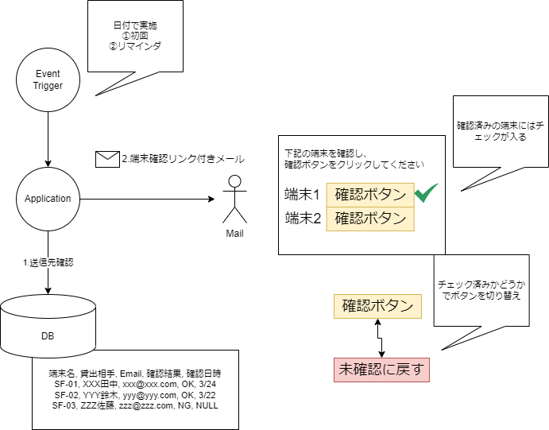
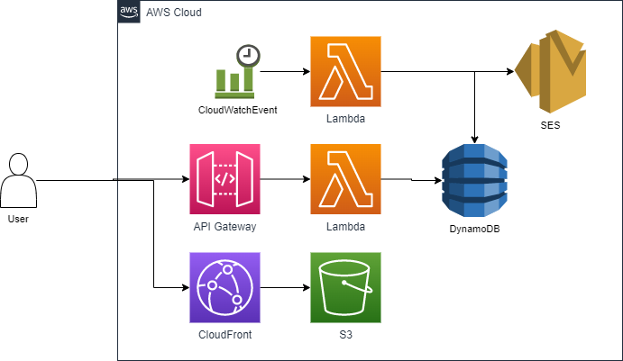

# confirm-inventries
## ■概要
端末棚卸作業を自動化する。

## ■システム化対象
1. 月次で端末貸出先に現物確認を依頼する
2. 確認できた端末を記録する
3. 確認できていない貸出先にリマインドする

## ■Middleware
### フロントエンド
Typescript(Node.js) + Angular.js

### バックエンド
Serverless Framework
Typescript(Node.js)

### DB
Aurora PostgreSQL

## システム構成（AWS）

